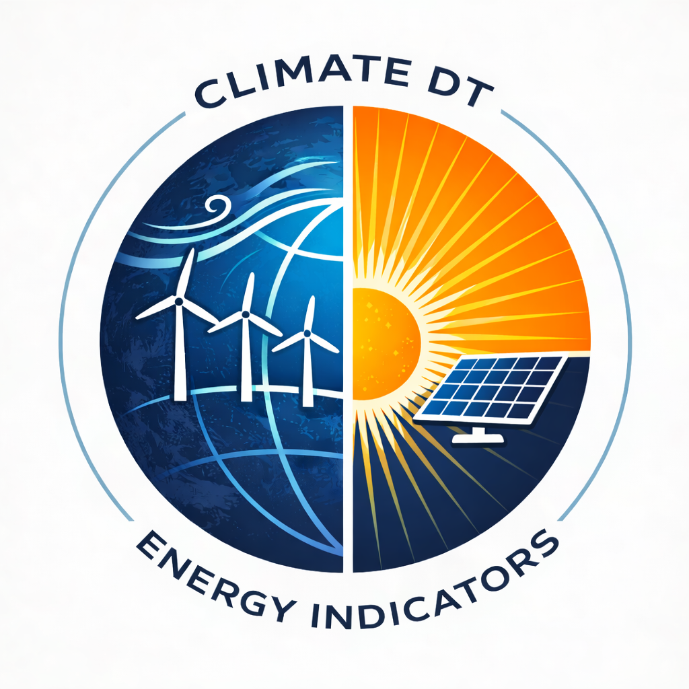

Energy Indicators
=================

The Energy Indicators application provides climate-derived metrics for the wind and solar energy sectors, translating kilometre-scale climate simulations into actionable indicators to support informed decision-making for near- to mid-term adaptation to climate change. The use case delivers standard diagnostics on resource availability, variability and extremes.

.. toctree::
   :maxdepth: 2
   :caption: Contents:

   general_description
   user_guide/index
   developer_guide/index
   api/index
