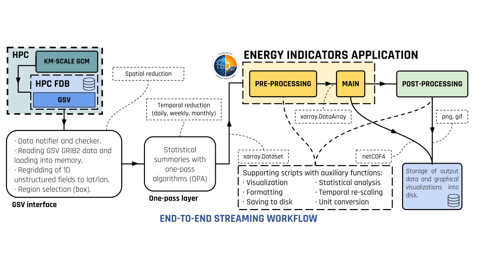
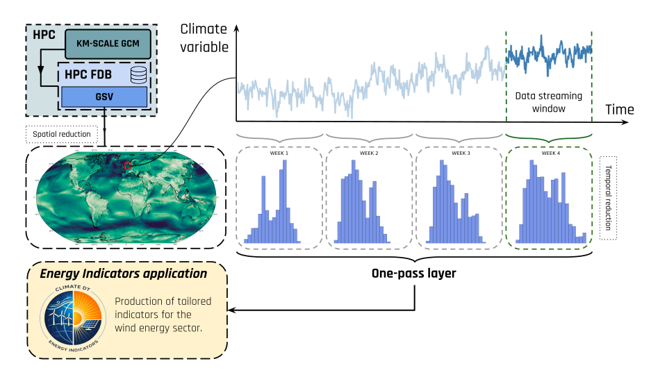

With the Workflow
=================

Integration in the workflow
-----------------------------

The Energy Indicators application is integrated into the Climate DT workflow through a data processing pipeline, which is visually summarised in the figure below. This pipeline extracts climate data and computes energy-specific metrics in streaming mode (i.e., while the climate simulation is running).

   Conceptual scheme of the Energy Indicators application integration into the Climate DT workflow.

Data Extraction and Processing
---------------------------------

In the Climate DT workflow, the climate models output km-scale high-frequency (i.e., hourly) fields, which are temporarily stored in GRIB format in a `Fields DataBase <https://github.com/ecmwf/fdb>`_ (FDB). In this process, the native model data is homogenised into a generic state vector (GSV), with a common `HEALPix <https://healpix.sourceforge.io/>`_ grid (Górski et al. 2005) and unified metadata. Before reaching the application, the climate data are retrieved from the GSV through the `GSV interface <https://github.com/DestinE-Climate-DT/GSV-Interface>`_, which supports spatial reduction (i.e., selecting a specific region), regridding onto a regular latitude/longitude grid, and conversion to NetCDF format.

One-pass layer
^^^^^^^^^^^^^^^

The workflow then processes the data retrieved from the GSV through the one-pass layer (Grayson et al. 2025), which performs a temporal reduction, deriving statistical summaries (e.g., percentile) with a specific output frequency (e.g., daily, weekly, monthly), and extracts several climate variables:

- Wind components (100u, 100v) at 100 m height for wind resource assessments.
- Wind components (10u, 10v) at 10 m height for PV potential calculation.
- 2-metre air temperature (2t) for demand-related metrics (such as heating and cooling degree days) and for PV potential calculation.
- Wind speed statistics.

   Conceptual scheme of the post-processing applied by the one-pass layer within the Climate DT workflow. Source: Lacima-Nadolnik et al. (preprint).

Energy Indicators computation
^^^^^^^^^^^^^^^^^^^^^^^^^^^^^^^

The processed climate data is then used by the Energy Indicators application to compute the indicators described above.

Workflow integration
^^^^^^^^^^^^^^^^^^^^^^

Within the Climate DT, this approach allows for the indicators to be computed at model runtime (i.e., while the simulation advances). As a result, the produced climate metrics are directly tailored for the renewable energy sector.

The applications run inside dedicated containers on high-performance computing (HPC) platforms from the `EuroHPC consortium <https://digital-strategy.ec.europa.eu/en/policies/high-performance-computing-joint-undertaking>`_.

Additional resources
------------------------

- `Energy Indicators application overview <https://gitlab.earth.bsc.es/digital-twins/de_340-3/energy_indicators>`_ (DestinE Climate DT energy indicators repository)
- `Workflow overview <https://gitlab.earth.bsc.es/digital-twins/de_340-3/workflow>`_ (DestinE Climate DT Workflow repository)
- `User story <https://destine.ecmwf.int/harnessing-the-climate-change-adaptation-digital-twin-for-wind-energy/>`_ from ECMWF.

.. toctree::
   :maxdepth: 2

   workflow_examples

